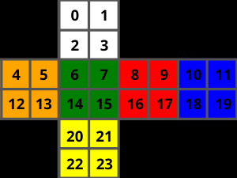
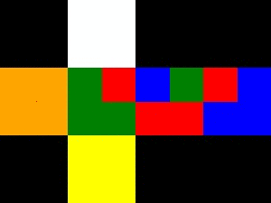

# RubiksCubeGym 
### An OpenAI Gym environment for various twisty puzzles.  
  
Currently available environments:  

 - [x] 2x2x2 Pocket Rubik's Cube 
 - [ ] Pyraminx
 - [ ] Skewb
  
## Details:  
### 2x2x2 Pocket Rubik's Cube  

|  |  |
|--|--|
| Action Space | Discrete(3) |
| Observation Space| Discrete(3674160) |
| Actions | F, R, U |  
| Rewards | (-inf, 100]  |
| Max steps | 250  |
| Reward Types | Base, Layer By Layer Method, Ortega Method |
| Render Modes | 'human', 'rgb_array', 'ansi' |

## Installation
Via PyPI

    pip install rubiks-cube-gym
Or build from source

    git clone https://github.com/DoubleGremlin181/RubiksCubeGym.git
    cd RubiksCubeGym
    pip install -e .

## Requirements

 - gym
 - numpy
 - opencv-python
 - wget

## Scrambling
You can pass the scramble as a parameter for the reset function
`self.reset(scramble="R U R' U'")`

The scramble should follow the [WCA Notation](https://www.worldcubeassociation.org/regulations/#article-12-notation)

##  Example
    import gym  
    import rubiks_cube_gym  
      
    env = gym.make('rubiks-cube-222-lbl-v0')  
    env.reset(scramble="R U R' U' R' F R2 U' R' U' R U R' F'")  
      
    for _ in range(4):  
        env.render()  
        print(env.step(1))  
    env.render(render_time=0)  
    env.close()
    
 

    (3178426, -26, False, {'cube': array([ 0,  9,  2, 15,  4,  5,  6, 21, 16, 10,  1, 11, 12, 13, 14, 23, 17, 7,  3, 19, 20, 18, 22,  8], dtype=uint8), 'cube_reduced': 'WRWGOOGYRBWBOOGYRGWBYBYR'})
    (1542962, -1, False, {'cube': array([ 0, 21,  2, 23,  4,  5,  6, 18, 17, 16, 15, 11, 12, 13, 14,  8,  7, 10,  9, 19, 20,  3, 22,  1], dtype=uint8), 'cube_reduced': 'WYWYOOGBRRGBOOGRGBRBYWYW'})
    (1682970, -1, False, {'cube': array([ 0, 18,  2,  8,  4,  5,  6,  3,  7, 17, 23, 11, 12, 13, 14,  1, 10, 16, 21, 19, 20,  9, 22, 15], dtype=uint8), 'cube_reduced': 'WBWROOGWGRYBOOGWBRYBYRYG'})
    (2220193, 25, False, {'cube': array([ 0,  3,  2,  1,  4,  5,  6,  9, 10,  7,  8, 11, 12, 13, 14, 15, 16, 17, 18, 19, 20, 21, 22, 23], dtype=uint8), 'cube_reduced': 'WWWWOOGRBGRBOOGGRRBBYYYY'})

